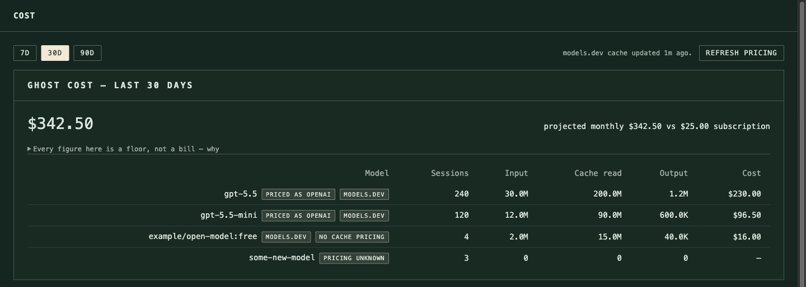

# hermes-cost-arbitrage

Dashboard plugin for [Hermes Agent](https://github.com/NousResearch/hermes-agent).
Prices your real token usage against any provider, so you can decide between a
flat subscription and pay-as-you-go APIs.

<!-- Screenshot of the /cost tab. To add: capture the tab in your dashboard,
     save it as docs/cost-tab.png, then uncomment the line below.

-->

## Why

When Hermes runs on a flat subscription, every session is recorded with
`billing_mode=subscription_included` and `estimated_cost_usd=0`. Both dashboard
analytics endpoints sum that column, so the Models page shows **`EST. COST $0`**.

That is correct accounting — a subscription call has no marginal cost — and it
is useless for deciding whether to switch. This plugin revalues the same tokens
at published API rates and answers the question the native pages structurally
cannot.

## What it shows

- **Ghost cost** — what your actual consumption would have cost on the paid
  API, per model actually used, over a 7/30/90-day window.
- **The catalogue** — every model in the local models.dev pricing cache
  (thousands of models, over a hundred providers), each row repricing your
  entire measured usage as if that candidate had served all of it. Server-side
  search, sort, pagination, capability filters (tool calling, vision,
  reasoning, open weights, minimum context) and a provider include/exclude
  facet.
- **Break-even** — what share of your current volume the subscription buys at
  each candidate's rates.
- **Long-context bound** — for models with tiered pricing, an explicit upper
  bound alongside the base figures, never silently blended in.
- **Switch from the tab** — a per-row control that adopts a catalogue model
  through Hermes' own validated switch path, after a real entitlement probe
  (one `max_tokens=1` test call) and a mandatory `config.yaml` backup.
- **A summary card** under the native Analytics page, supplying the number
  that page structurally cannot compute.

Every model is priced under **two cache scenarios**. Cache reads are typically
the large majority of an agent's token volume, and a provider without a prompt
cache bills them at the full input rate — several times more. A single figure
would be misleading, so both are always shown.

## Reading the numbers

[docs/USAGE.md](docs/USAGE.md) explains every figure, badge and degraded state
in the tab — where each number comes from, and how much to trust it. Read it
once before you act on any figure.

## Requirements

- A running [Hermes Agent](https://github.com/NousResearch/hermes-agent)
  installation — developed against **v0.17.0**.
- Nothing else: the plugin runs inside the Hermes dashboard process and has no
  Python dependencies of its own. The frontend uses the dashboard's plugin SDK
  (no bundled React, no build step).

## Install

```bash
hermes plugins install banzaisoftware/hermes-cost-arbitrage
hermes dashboard --stop   # if a dashboard is already running
hermes dashboard
```

This is a dashboard-only plugin — it has no `plugin.yaml`, so `hermes plugins
enable` does not apply to it and will report it as not installed. The
dashboard discovers it directly from `dashboard/manifest.json`, regardless of
enabled/disabled state. The restart is the step that actually matters: the
dashboard mounts a plugin's API routes once, at startup, so the tab will load
but every request will 404 until the process is restarted.

`hermes plugins install` may also print:

```
Warning: hermes-cost-arbitrage doesn't contain plugin.yaml or __init__.py. It may not be a valid Hermes plugin.
```

This is expected for a dashboard-only plugin and can be ignored — adding a
bare `plugin.yaml` to silence it would require an `__init__.py` with a
`register(ctx)` function, which would register this plugin with the agent's
own plugin loader, not just the dashboard.

Then open the **Cost** tab in the dashboard.

## Accuracy

Figures are a **floor, not a bill**. Local token counts exclude auxiliary calls
and provider retries, so real provider billing sits above these numbers. The
error runs against the pay-as-you-go option, which keeps the comparison
conservative in favour of the subscription.

## Safety

The plugin is read-only against Hermes with one deliberate exception: the
switch-model endpoint, which writes through the host's own validated config
path and only after a rotated backup of `config.yaml` succeeds. `state.db` is
always opened read-only, and no `GET` endpoint ever performs network I/O — the
only network requests are the explicit pricing-cache refresh button and the
pre-switch entitlement probe.

## Configuration

Settings live in `$HERMES_HOME/cost_arbitrage_config.json`:

```json
{
  "subscription_usd_per_month": 23.0,
  "pinned": [{ "provider": "openai", "model": "gpt-5.5" }]
}
```

`subscription_usd_per_month` is the flat price every figure is compared
against; `pinned` marks models with a `pinned` badge in the catalogue. There
is no in-tab editor yet: for now this file is edited by hand and picked up on
the next request — no restart needed.

## Development

```bash
python3 -m venv .venv && .venv/bin/pip install -r requirements-dev.txt
.venv/bin/pytest -v
node tests/bundle_smoke.mjs
```

The cost engine is a pure function, so the whole Python suite runs without
Hermes installed. The Node smoke test evaluates the frontend bundle and
renders every component against a stub SDK.

One thing that surprises contributors: `dashboard/dist/index.js` is
**hand-written**, not compiled — there is no bundler, no `npm build`, and no
vendored React. The dashboard's plugin SDK supplies React and the host's own
UI components at runtime, which is what keeps the plugin dependency-free and
rendered in the dashboard's native look. Edit `dist/index.js` directly.

Design rationale lives in [docs/DESIGN.md](docs/DESIGN.md); what's planned
next in [ROADMAP.md](ROADMAP.md).

## Contributing

Issues and pull requests are welcome. For anything beyond a small fix, open an
issue first — the scope boundaries in [ROADMAP.md](ROADMAP.md) (and the
"deliberately not" lists in [docs/DESIGN.md](docs/DESIGN.md)) explain why some
obvious features are intentionally absent.

## Licence

MIT © 2026 Banzai Software
